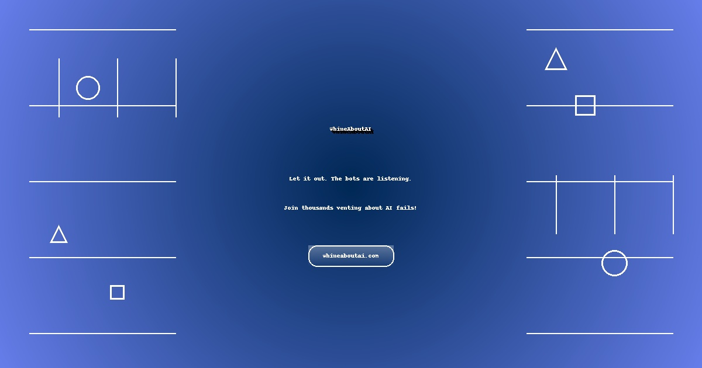

# WhineAboutAI.com - Where AI Failures Become Features™

A satirical platform for venting frustrations about AI mishaps, featuring interactive complaint submission, AI-powered tools, and a sarcastic AI therapist chatbot.



## 🌟 Overview

WhineAboutAI.com is a humorous website where users can share their AI disasters, from autocorrect fails to smart home catastrophes. The site features dynamic content, interactive tools, and WhineBot - a sarcastic AI therapist powered by OpenAI's GPT-4.

**Live Site:** [https://whineaboutai.com](https://whineaboutai.com)

## 🚀 Features

### Core Features
- **Interactive Complaint System** - Submit and share your AI horror stories
- **WhineBot Therapist** - Sarcastic AI chatbot for venting (OpenAI GPT-4 powered)
- **Dynamic Content** - 44 rotating complaints and 40 fake ads for variety
- **Real-time Stats** - Dynamic counters based on time of day
- **Responsive Design** - Mobile-friendly Bootstrap 5.3.2 layout

### Interactive AI Tools (/ai-tools.html)
1. **AI Complaint Generator** - Smart complaint creation with adjustable anger levels
2. **AI Complaint Bingo** - Interactive 5x5 game with win detection
3. **Meme Generator** - Canvas-based meme creation with download functionality
4. **Tweet Generator** - Create viral tweets with hashtags
5. **Hall of AI Suffering** - Leaderboard of legendary complaints
6. **Visual Rage Meters** - Dynamic anger visualization
7. **Category Filtering** - Filter complaints by type
8. **Voting System** - Three reaction types: Relatable, Hilarious, Tragic

## 🛠️ Technical Stack

### Frontend
- **HTML5** - Single-page application with inline styles and scripts
- **Bootstrap 5.3.2** - Professional responsive design
- **Vanilla JavaScript** - No framework dependencies
- **Google Analytics GA4** - User tracking (ID: G-48GGY3RC9G)
- **Google AdSense** - Monetization (Publisher ID: ca-pub-5497961962190935)

### Backend (Serverless)
- **Python 3.x** - Vercel serverless functions
- **OpenAI API** - GPT-4 integration for WhineBot
- **CORS Enabled** - Cross-origin support for API calls

### Hosting & Infrastructure
- **GitHub Pages** - Static site hosting
- **Vercel** - Serverless function hosting
- **Cloudflare** - DNS management
- **SSL Certificate** - HTTPS enabled

## 📁 Project Structure

```
whineaboutai-repo/
├── index.html              # Main website (all frontend code)
├── ai-tools.html           # Interactive AI tools page
├── contact.html            # Contact page
├── privacy-policy.html     # Privacy policy (AdSense compliant)
├── terms-of-service.html   # Terms of service
├── api/                    # Vercel serverless functions
│   ├── chat.py            # WhineBot chat endpoint
│   ├── contact.py         # Contact form handler
│   ├── enhance-complaint.py
│   ├── predict-fail.py
│   ├── generate-comeback.py
│   ├── create-meme.py
│   └── battle-commentary.py
├── vercel.json            # Vercel configuration
├── requirements.txt       # Python dependencies
├── robots.txt            # SEO robot instructions
├── sitemap.xml           # SEO sitemap
├── ads.txt               # AdSense verification
├── CNAME                 # GitHub Pages custom domain
├── favicon.ico           # Site favicon
└── whine-about-ai-share.jpg # Social media share image
```

## 🚀 Setup & Deployment

### Prerequisites
- GitHub account
- Vercel account (for serverless functions)
- OpenAI API key (for WhineBot)
- Domain with Cloudflare DNS (optional)

### Local Development

1. Clone the repository:
```bash
git clone https://github.com/kurthamm/whineaboutai.git
cd whineaboutai
```

2. Install Python dependencies (for backend):
```bash
pip install -r requirements.txt
```

3. Set environment variables:
```bash
export OPENAI_API_KEY="your-openai-api-key"
```

4. Test locally:
```bash
# For static files
python -m http.server 8000

# For Vercel functions
vercel dev
```

### Deployment

#### GitHub Pages (Frontend)
1. Push to main branch
2. GitHub Pages auto-deploys from main branch
3. Custom domain configured via CNAME file

#### Vercel (Backend APIs)
1. Connect GitHub repo to Vercel
2. Set environment variables in Vercel dashboard:
   - `OPENAI_API_KEY`
3. Deploy automatically on push

## 🔧 Configuration

### Environment Variables
- `OPENAI_API_KEY` - Required for WhineBot chat functionality

### API Endpoints
All API endpoints are serverless functions hosted on Vercel:
- `POST /api/chat` - WhineBot chat interface
- `POST /api/contact` - Contact form submission
- `POST /api/enhance-complaint` - AI complaint enhancement
- `POST /api/predict-fail` - AI failure prediction
- `POST /api/generate-comeback` - Comeback generator
- `POST /api/create-meme` - Meme text generator
- `POST /api/battle-commentary` - Complaint battle narrator

## 📊 Analytics & Monetization

### Google Analytics
- Tracking ID: `G-48GGY3RC9G`
- Tracks page views, user interactions, and complaint submissions

### Google AdSense
- Publisher ID: `ca-pub-5497961962190935`
- Ad placements configured for optimal revenue
- Compliant with AdSense policies

### Future Monetization
- Amazon Associates program (prepared for integration)
- Sponsored content sections
- Premium features consideration

## 🎨 Design Philosophy

The site follows a professional yet playful design approach:
- Clean Bootstrap layout for credibility
- Gradient accents for visual interest
- Humorous copy throughout
- Mobile-first responsive design
- Accessibility considerations

## 🤖 WhineBot Integration

WhineBot is the site's AI therapist chatbot that responds to user complaints with sarcasm and humor.

### Features
- OpenAI GPT-4 powered responses
- Contextual sarcasm based on complaint type
- Fallback responses for API failures
- Character limit for concise responses
- Typing indicator for realism

### System Prompt
WhineBot is configured as "the world's most entertainingly sarcastic AI therapist specializing in AI failures" with guidelines for humor, self-awareness, and therapeutic jokes.

## 🔒 Security & Privacy

- No user authentication required
- No personal data storage
- HTTPS enforced
- CORS properly configured
- API rate limiting via Vercel
- Privacy policy compliant with regulations

## 🐛 Known Issues & Limitations

1. **Backend APIs** - Currently require Vercel hosting for Python functions
2. **API Keys** - OpenAI key required for full WhineBot functionality
3. **Rate Limits** - Subject to Vercel and OpenAI rate limits
4. **Static Content** - Some features would benefit from database storage

## 🚧 Future Enhancements

### Short Term
- User accounts and complaint history
- Comment threads on complaints
- Social media sharing integration
- Weekly complaint compilations

### Long Term
- Mobile app (React Native/Flutter)
- AI Fails news aggregator
- Company response tracker
- Complaint-to-song generator
- Virtual support groups

## 📝 Contributing

While this is primarily a showcase project, suggestions and bug reports are welcome:

1. Fork the repository
2. Create a feature branch
3. Commit changes
4. Push to the branch
5. Open a Pull Request

## 📄 License

This project is proprietary software. All rights reserved.

## 👥 Credits

- **Creator**: Kurt Hamm
- **AI Assistant**: Claude (Anthropic)
- **Design Framework**: Bootstrap Team
- **Icons**: Native emoji support
- **Inspiration**: Every AI that has ever failed us

## 📞 Contact

For inquiries, complaints about the complaint site, or to report that our AI complaint site's AI is complaining:
- Visit: [/contact](https://whineaboutai.com/contact)
- Or use WhineBot for immediate sarcastic support

---

*Remember: When life gives you AI lemons, make a complaint website!* 🍋🤖